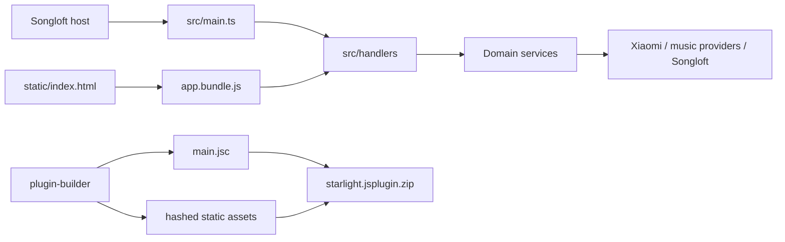

# Project Overview

## Preliminary Direction

Preserve the current behavior and post-review fixes while reducing redundant code and unnecessary package contents, using measured artifact size rather than source line count as the primary signal.

## Current Architecture

The backend is TypeScript bundled as one production IIFE and compiled for QuickJS. The UI is a plain HTML/CSS application whose ES modules are bundled into one browser asset. The plugin builder hashes static assets and packages the compiled backend plus the complete staged static directory.

## Technology Stack

| Layer | Current | Target |
|:--|:--|:--|
| Language | TypeScript backend, JavaScript UI | Unchanged |
| Runtime | Songloft QuickJS plugin host | Unchanged |
| Build | `@songloft/plugin-builder` 2.4.3 / esbuild / JSC | Deterministic clean build |
| Package manager | npm | Unchanged |
| Tests | Vitest 3.2 | Add artifact regression coverage |
| Deployment | GitHub Actions release ZIP | Unchanged |

## Entry Points

- Backend: `src/main.ts`
- UI: `static/index.html` and `static/js/app.js`
- Build: `npm run build`
- Validation: `npm run typecheck`, `npm test`, `npm run validate`
- Release: `.github/workflows/release.yml`

## Build & Run

The current `build` script invokes `songloft-plugin build` directly. The repository already contains `scripts/clean-dist.mjs`, but it is not connected to the build lifecycle. The builder creates `dist/_build` without removing its previous contents, hashes the current assets, and then packages the whole staging directory.

Measured on commit `94a80d4`:

| Build state | ZIP size | ZIP entries |
|:--|--:|--:|
| Dirty accumulated `dist` | 1,005,842 bytes | 50 |
| Clean rebuild | 949,055 bytes | 42 |

The dirty ZIP contained five `player.<hash>.js` generations, three browser-player generations, two source-module generations, and two stylesheets. A clean build removes about 56.8 KB compressed. The clean package was initially dominated by `main.jsc` (730,458 compressed bytes), followed by the PNG icon (88,001 bytes) and browser bundle (39,100 bytes). The user subsequently chose to remove the newly added pure-JavaScript GBK compatibility table; the post-removal baseline is tracked in the implementation plan.

## Testing Baseline

The baseline is strong at the unit and contract level: 100 test files and 622 tests pass, and type checking succeeds. Browser playback has explicit concurrency/state tests. Missing coverage is concentrated around artifact contents, repeat-build determinism, browser rendering, and package-size budgets.

## Project Governance Baseline

No `AGENTS.md`, `CLAUDE.md`, platform rule directory, native project memory, or existing `docs/progress/MASTER.md` was found. The release workflow is the only repository-level automation surface. No repo-local memory file will be created without user selection.

## External Integrations

- Xiaomi Mina and MiIO APIs
- Multiple music search, URL, ranking, and lyric providers
- Songloft storage, song, playlist, inter-plugin, command, JS environment, and websocket APIs
- LX Music synchronization protocol
- GitHub Actions and GitHub Releases

## Tracking Mode

`GITHUB_STANDARD`: `gh` is authenticated for `snakeJohn/starlight` with repository access, but the token lacks `read:project`, so Project board access is unavailable.
